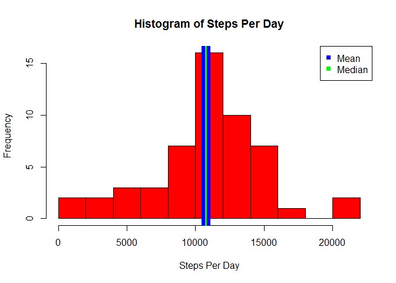
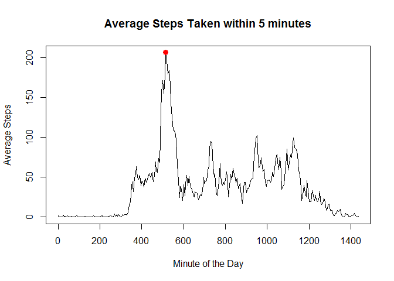
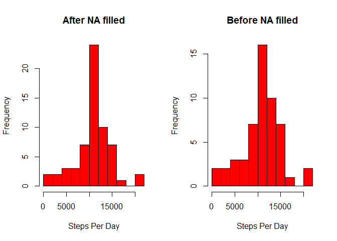
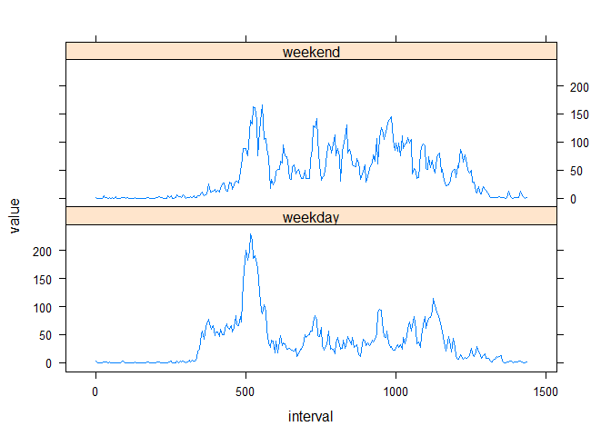

# Walking Activity Analysis

## Introduction

This analysis makes use of data from a personal activity monitoring device. This device collects data at 5 minute intervals through out the day. The data consists of two months of data from an anonymous individual collected during the months of October and November, 2012 and include the number of steps taken in 5 minute intervals each day.


```r
if (!file.exists("repdata%2Fdata%2Factivity.zip")){
    fileURL <- "https://d396qusza40orc.cloudfront.net/repdata%2Fdata%2Factivity.zip"
    download.file(fileURL, "repdata%2Fdata%2Factivity.zip")
}  

if (!file.exists("activity.csv") ){
    unzip("repdata%2Fdata%2Factivity.zip") 
}

data <- read.csv("activity.csv")
```

With the data frame "data", a series of questions will be addressed.

## What is mean total number of steps taken per day?


```r
stepPerDay <- with(data, tapply(steps, date, sum))

mean <- mean(stepPerDay, na.rm = TRUE)
median <- median(stepPerDay,na.rm = TRUE)

hist(stepPerDay, xlab = "Steps Per Day", main = "Histogram of Steps Per Day", col = "red", breaks = 10)
abline(v=mean, lwd = 15, col = 'blue')
abline(v=median, lwd = 3, col = 'green')
legend("topright", pch = 15, col = c("blue", "green"), legend = c("Mean", "Median"))
```

<!-- -->


The total number of steps taken per day have a mean of 1.0766189\times 10^{4} and a median of 10765, without missing values.


## What is the average daily activity pattern?


```r
aveWithDate <- with(data, tapply(steps, interval, mean, na.rm = TRUE))
interval <- seq(0,23*60 +55, 5)
plot(interval, aveWithDate, type = "l", xlab = "Minute of the Day", ylab = "Average Steps", main = "Average Steps Taken within 5 minutes")
points(interval[which(aveWithDate == max(aveWithDate))], max(aveWithDate), col = "red", cex = 1.2, pch = 19)
```

<!-- -->

```r
maxTime <- which(aveWithDate == max(aveWithDate))
max <- names(maxTime) 
```


On average across October and November, the 5-minute interval 835 (8:35 am - 8:40 am) contains the maximum number of steps.


## Imputing missing values


```r
missing <- sum(is.na(data$steps))
nrow <- nrow(data)
```

There are 2304 out of 17568 rows of data without the number of steps. In this analysis, the steps taken of each 5-minute interval, averaged across all days, will be used to fill the missing values. A new data set "data1" is created.


```r
data1 <- data

for (i in 1:dim(data1)[1]){
        if (is.na(data1[i,1])){
                num <- as.character(data1[i,3])
                data1[i,1] <- round(aveWithDate[num])
        }
}

stepPerDay1 <- with(data1, tapply(steps, date, sum))
mean1 <- mean(stepPerDay1, na.rm = TRUE)
median1 <- median(stepPerDay1,na.rm = TRUE)

par(mfrow = c(1,2))
hist(stepPerDay1, xlab = "Steps Per Day", main = "After NA filled", col = "red", breaks = 10)
hist(stepPerDay, xlab = "Steps Per Day", main = "Before NA filled", col = "red", breaks = 10)
```

<!-- -->


The new number of steps has a mean of 1.0765639\times 10^{4} and a median of 1.0762\times 10^{4}, which are roughly the same as those before missing values are filled in.

However, the distribution of the total steps per day are more concentrated to its center, that is, becomes less sparse. 


## Are there differences in activity patterns between weekdays and weekends?


```r
data1$weekend[weekdays(as.Date(data1$date)) %in% c("Saturday", "Sunday")] <- "weekend"
data1$weekend[!(weekdays(as.Date(data1$date)) %in% c("Saturday", "Sunday"))] <- "weekday"
data1$weekend <- as.factor(data1$weekend)

aveWithDate1 <- with(data1, tapply(steps, list(interval,weekend), mean))
interval <- seq(0,23*60 +55, 5)
aveWithDate1 <- as.data.frame(cbind(interval, aveWithDate1))
require(reshape2)
```

```
## Loading required package: reshape2
```

```r
aveWithDate1 <- melt(aveWithDate1, id.vars="interval")
library(lattice)
xyplot(value ~ interval | variable, data = aveWithDate1, layout = c(1, 2), type = "l")
```

<!-- -->
